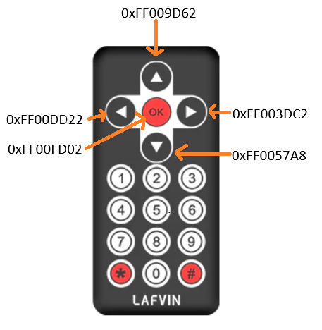
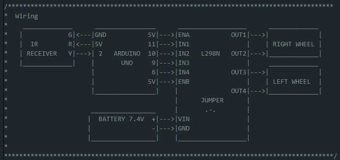

# IR Controlled DDR

In this simple project, the IR receiver present in the LA018_2WD_SmartRobotCar kit is used along a remote control to command the robot motion at a constant speed in four manners:
	- go forward
	- go backward
	- turn clockwise
	- turn counter clockwise

These motions can be appretiated on the next figures.
 

 

Once more, no available IR libraries are used. An own library is used instead based on the project in this [link](https://github.com/mbabeysekera/advanced-arduino-ir-remote) by using the Arduino interrupt pin attached on pin 2 and the function [micros()](https://docs.arduino.cc/language-reference/en/functions/time/micros/).

## Remote decoder

Before stteping into the project on the [2_IR_controlled_ddr](./2_IR_controlled_ddr/) folder, we need to know how to interpret the received information from the remote. This can be achieved by first loading the project [IRDecoder](./IRDecoder/) and trying the keys in the remote you want to use. The key value attached to it will be shown on the Serial Monitor in the Arduino IDE on hex format.

In my case, I am using the arrow and OK keys on my remote which decode according to the image below.

These values are then used on the [2_IR_controlled_ddr](./2_IR_controlled_ddr/) folder in an intuitive manner to make the robot move (the OK key is used to stop it).

## Wiring

Using the code provided at this project, you would need to wire your components as in the simple diagram shown below. This diagram can be also found in the [2_IR_controlled_ddr.ino](./2_IR_controlled_ddr/2_IR_controlled_ddr.ino) file.

## Libraries

The libraries needed to run this project are listed below. They must be placed at *./distanceKeeper/src*.

Need libraries:
	- typeDefs
	- DDR
	- IRDecoder
