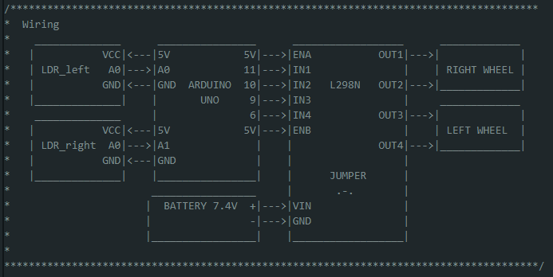

# Light follower

In this project, I am including a couple of LDR (Light Depending Resistor) modules to each side of the front part of the robot. LDR modules do not make part of the LA018_2WD_SmartRobotCar kit. These sensors are used to create a light following robot.

The servo attached at the bottom of the HCSR04 changes angle according to the light position to "follow the light". Note that in this project, the HCSR04 sensor is not enabled.

## Wiring
Using the code provided in this project, you would need to wire your components as in the simple diagram shown below. This diagram can be also found in the *lightFollower.ino* file.

## LDR and speed control
Both LDR modules are connected to one of the analog inputs on the Arduino. In the Arduino UNO, read analog inputs return values from 0 to 1023 since they are 10-bit analog to digital converter channels.

In the case of the LDR, when full light strikes directly on the sensor a value of 0 is read, when in darkness 1023 is returned. For this reason, the speed of every wheel is proportional to the signal read from the sensor attached to it (left sensor to the left wheel and right sensor to the right wheel).

## Operational modes

## Libraries

The libraries needed to run this project are listed below. They must be placed at *./lightFollower/src*.

Need libraries:
- typeDefs
- commonAlgo
- DDR
- myServo
