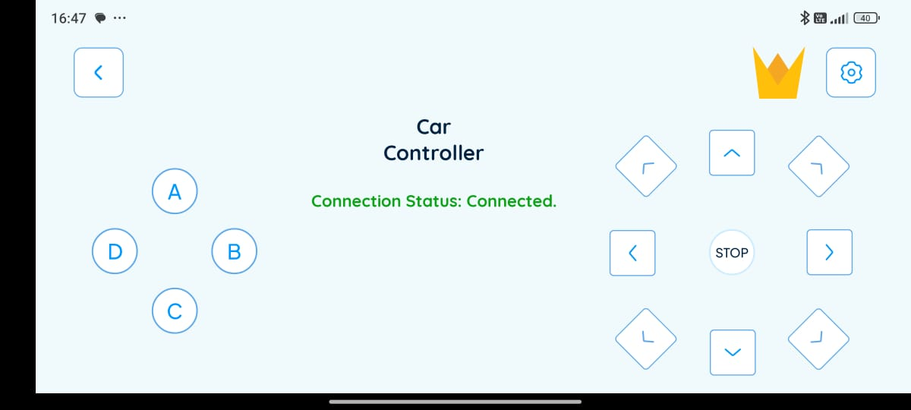
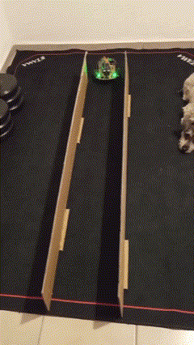
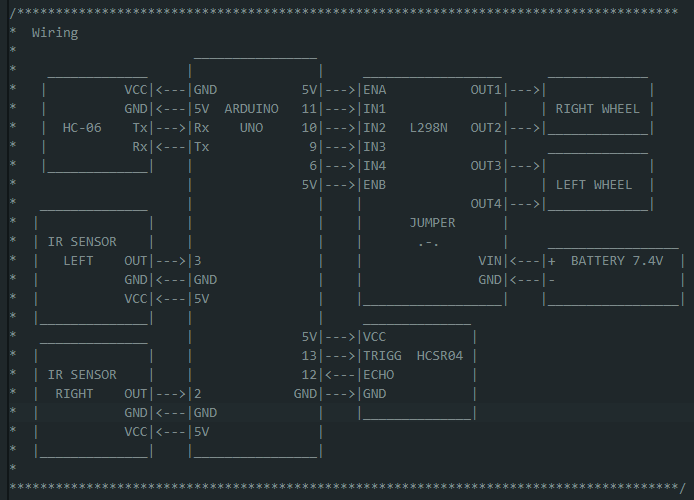

# Obstacle Avoidance Car

## Bluetooth and Obstacle Avoidance - Dual Mode
Using the code from the  project [BT controlled DDR](../4_BT_controlled_ddr/), we can toggle between controlling the robot ourselves using the bluetooth approach or letting the robot wander by it self avoiding obstacle collisions. 

To get to the BT controlloed mode, press the B button. For an self driving mode, press A. By pressing either D or C, the robot stops.

## IR Sensors for side correctness

Since the HCSR04 sensor is not capable to "see" the obstacles to the sides of the robot, I'm including IR sensors to each side in order to correct the robot speed when an obstacle is detected. This is useful for wall following.

## Wiring
Using the code provided at this project, you would need to wire your components as in the simple diagram shown below. This diagram can be also found in the [obstacle_avoidance_car.ino](./obstacle_avoidance_car/obstacle_avoidance_car.ino) file.

## Further work
A couple more videos of the implementations can be found below. There is room for improvement as a finer tunning can be implemented to achieved better results.

