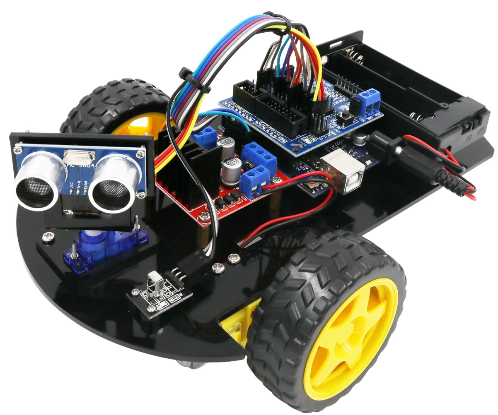

# LA018_2WD_SmartRobotCar (under construction)
In this project I experiment over the [LA018WD Smart Robot Car Kit V1](https://lafvintech.com/products/lafvin-smart-robot-car-2wd-chassis-kit-with-ultrasonic-module-l298n-driver-board-remote-ir-control-for-arduino-uno-diy-kit) from LAFVIN. I use the sensors and modules provided in the kit and some others, such like a bluetooth module, LDR, A3144 and Lm393 sensor modules, in order to customize the system.

The project is separated over a total of 5 implementations that can be found in the folders and that are listed below.
* Namely Distance Keeper
* IR Controlled Car
* Bluetooth Controlled Car
* Light Controlled Car
* Obstacle Avoidance Car.

It is worth mentioning that none of the codes in the LAFVIN tutorials is being used. However, the tutorial and code can be found in this [link](https://www.dropbox.com/sh/a9449isour59wxb/AAC0MyeXVrMPYCr38tk-wpcca/Code?dl=0&subfolder_nav_tracking=1).

